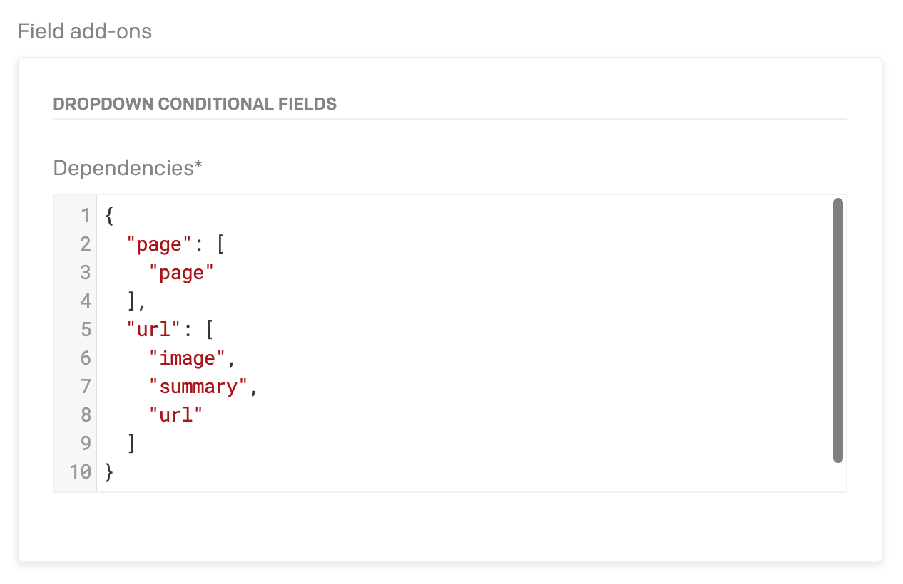

# Dropdown Conditional Fields DatoCMS plugin

Allow fields to be hidden/shown based on the values of a dropdown field.

## Configuration

Configuration requires a json object with the keys as lowercase strings, and the
values as the api keys of the fields to show when the value is present.

This plugin will combine all the fields for each key and hide them all on a new
record and that is how it determines what fields to hide.



## Development

Install all the project dependencies with:

```
yarn install
```

Add this plugin in development mode to one of your DatoCMS project with:

```
yarn addToProject
```

Start the local development server with:

```
yarn start
```

The plugin will be served from [http://localhost:5000/](http://localhost:5000/). Insert this URL as the plugin [Entry point URL](https://www.datocms.com/docs/plugins/creating-a-new-plugin/).

## Publishing

Before publishing this plugin, make sure:

* you've properly described any configuration parameters in this README file;
* you've properly compiled this project's `package.json` following the [official rules](https://www.datocms.com/docs/plugins/publishing/);
* you've added a cover image (`cover.png`) and a preview GIF (`preview.gif`) into the `docs` folder.

When everything's ready, just run:

```
yarn publish
```
